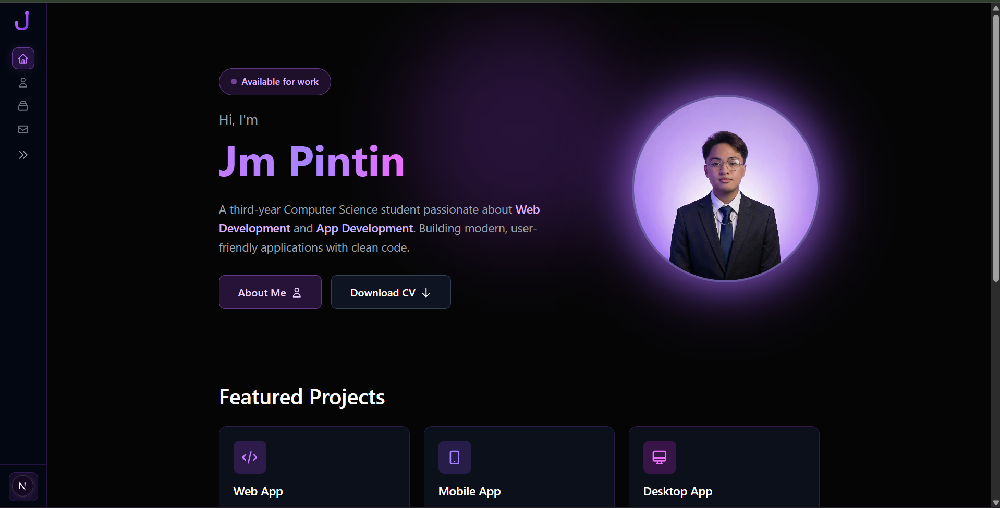

# Jm Pintin Portfolio

A modern, responsive portfolio website built with Next.js 16, Tailwind CSS v4, and shadcn/ui.



## ✨ Features

- 🎨 **Dark Purple Theme** - Modern gradient design with purple accents
- 📱 **Fully Responsive** - Works on mobile, tablet, and desktop
- 🚀 **Collapsible Sidebar** - Smooth animations with content area sync
- 📊 **GitHub Integration** - Real-time language stats from GitHub API
- 🔍 **Project Filtering** - Filter by Web, Mobile, or Desktop projects
- 📧 **Contact Form** - Gmail integration for direct messaging

## 🛠️ Tech Stack

- **Framework**: Next.js 16 (App Router)
- **Language**: TypeScript
- **Styling**: Tailwind CSS v4
- **UI Components**: shadcn/ui
- **Fonts**: Geist Sans & Mono
- **Icons**: Custom SVG

## 📄 Pages

| Page | Description |
|------|-------------|
| **Home** | Hero section with profile, featured projects |
| **About** | Bio, skills (GitHub-powered), experience, education |
| **Projects** | Filterable project grid with 7 projects |
| **Contact** | Contact form with Gmail compose integration |

## 🚀 Projects Showcased

| Project | Type | Technologies |
|---------|------|--------------|
| SpendSense | Web | TypeScript, Next.js, Tailwind CSS, Supabase |
| TaskFlow | Mobile | Kotlin |
| Student Management System | Desktop | Python, Tkinter |
| Rideal | Mobile | Dart, Flutter |
| Tic-Tac-Toe | Web | React, JavaScript, CSS |
| Tip Calculator | Web | TypeScript, Next.js, Tailwind CSS |
| Netflix Clone | Web | Vue, JavaScript, Tailwind CSS |

## 🏃 Getting Started

### Prerequisites

- Node.js 18+
- npm or yarn

### Installation

```bash
# Clone the repository
git clone https://github.com/devjeyem/portfolio.git

# Navigate to directory
cd portfolio

# Install dependencies
npm install

# Run development server
npm run dev
```

Open [http://localhost:3000](http://localhost:3000) to view the site.

## 📁 Project Structure

```
src/
├── app/
│   ├── page.tsx          # Home page
│   ├── about/            # About page
│   ├── projects/         # Projects page
│   ├── contact/          # Contact page
│   ├── layout.tsx        # Root layout
│   └── globals.css       # Global styles
├── components/
│   ├── sidebar.tsx       # Collapsible sidebar
│   ├── footer.tsx        # Footer component
│   └── github-skills.tsx # GitHub language stats
└── lib/
    └── utils.ts          # Utility functions
public/
└── projects/             # Project images
```

## 🎨 Customization

### Adding Projects

Edit `src/app/projects/page.tsx` and add to the `projects` array:

```typescript
{
  id: 8,
  title: "Your Project",
  description: "Project description here",
  image: "/projects/your-project.png",
  githubUrl: "https://github.com/your-repo",
  type: "web", // web | mobile | desktop
  languages: ["Tech", "Stack"],
  imageStyle: "cover" as const, // cover | contain
}
```

### Updating Personal Info

- **Name/Email**: Update in `sidebar.tsx`, `footer.tsx`, `page.tsx`
- **Social Links**: Edit URLs in `footer.tsx`
- **Bio**: Update content in `about/page.tsx`

## 🚀 Deployment

Deploy easily on [Vercel](https://vercel.com):

```bash
npm run build
```

Or connect your GitHub repo to Vercel for automatic deployments.

## 📝 License

MIT License - feel free to use this template for your own portfolio!

## 👤 Author

**Jm Pintin**
- GitHub: [@devjeyem](https://github.com/devjeyem)
- Email: pintsjm@gmail.com
